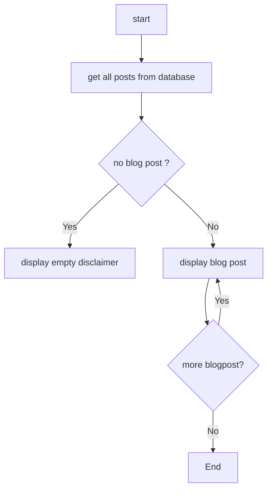
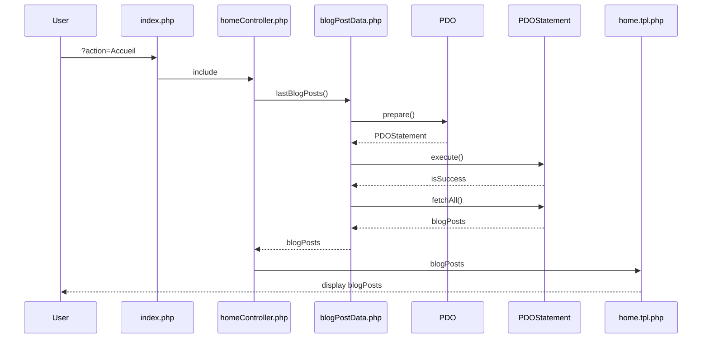
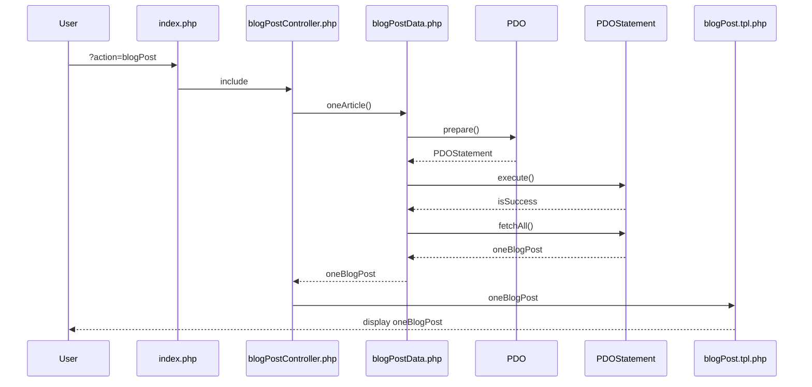
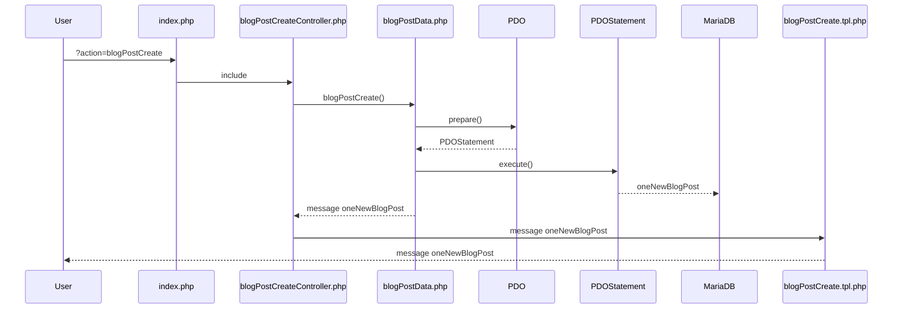
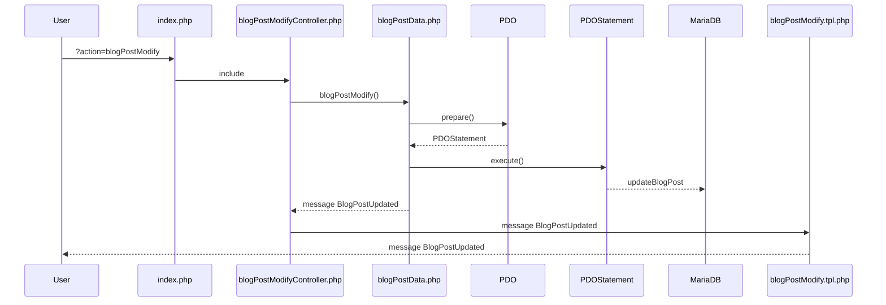
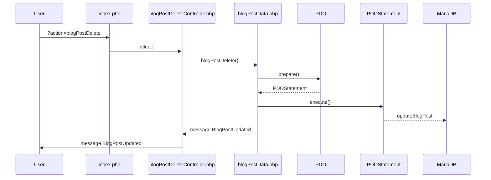

# Logigramme

# diagramme de séquence
## de l'affichage de la liste des derniers articles

## de l'affichage d'une page Article avec des infos et des commentaires

## de la création d'un article

## de la modification d'un article

## de la suppression d'un article
