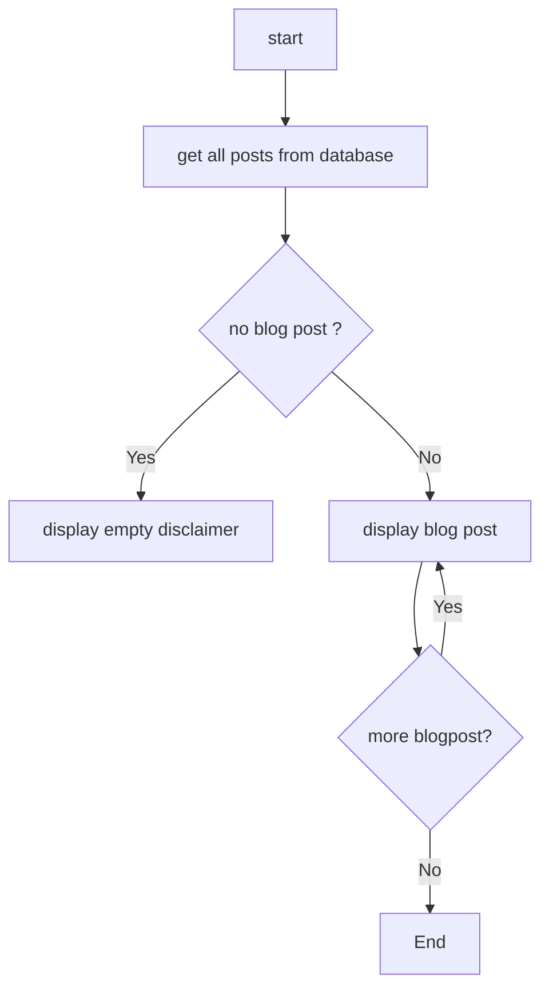
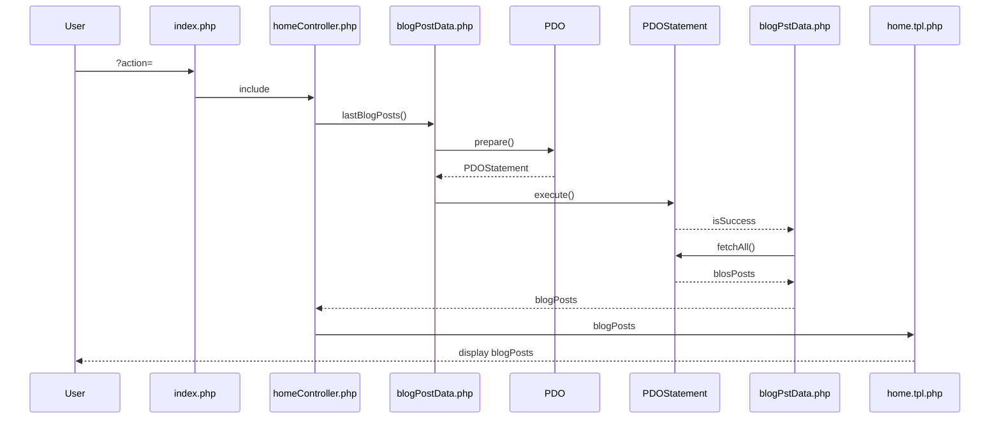

```mermaid
graph TD
    A[start] --> B[get all posts from database]
    B --> C{no blog post ?}
    C -- Yes --> D[display empty disclaimer]
    C-- No --> E[display blog post]
    E --> F{more blogpost?}
    F -- Yes --> E
    F -- No --> G[End]
```

```mermaid
sequenceDiagram
    User->>index.php: ?action=
    index.php->>homeController.php: include
    homeController.php->>blogPostData.php: lastBlogPosts()
    blogPostData.php->>PDO: prepare()
    PDO-->>blogPostData.php: PDOStatement
    blogPostData.php->>PDOStatement: execute()
    PDOStatement-->>blogPstData.php: isSuccess
    blogPstData.php->>PDOStatement: fetchAll()
    PDOStatement-->>blogPstData.php: blosPosts
    blogPstData.php-->>homeController.php: blogPosts
    homeController.php->>home.tpl.php: blogPosts
    home.tpl.php -->>User: display blogPosts
```